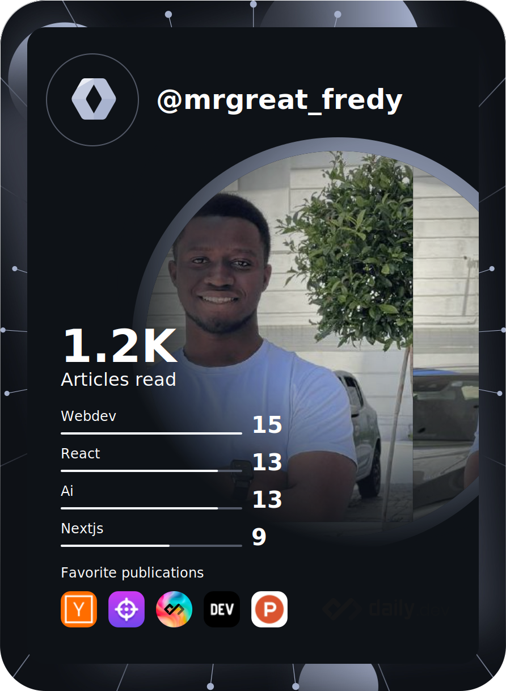

<h1 align="center">Hi 👋, I'm Fredy</h1>
<h3 align="center">A passionate full-stack developer from Tanzania</h3>

- 🌱 I’m currently learning **Machine Learning, Django and Flutter**

- 👯 I’m looking to collaborate on **any project**

- 👨‍💻 Some of my projects are available at <a href="https://www.mrgreat.greatcompanies.net" target="_blank"> Here </a>

- 📫 How to reach me **fredgerman30@gmail.com**

- ⚡ Fun fact **I use emojis while commenting my code**

<h3 align="left">Languages and Tools:</h3>

                         

<!--    This is the manual Dev Card the one below is the automatic one. -->

<!--  -->

